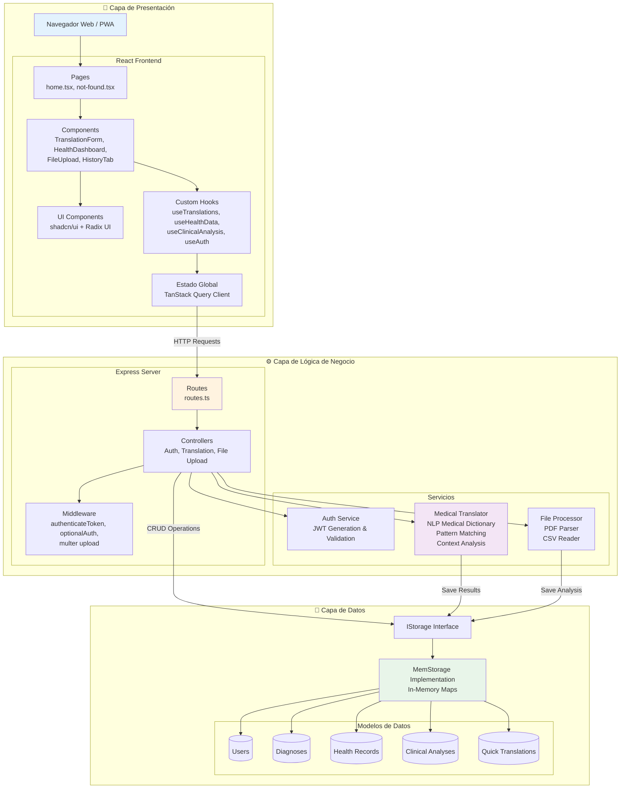
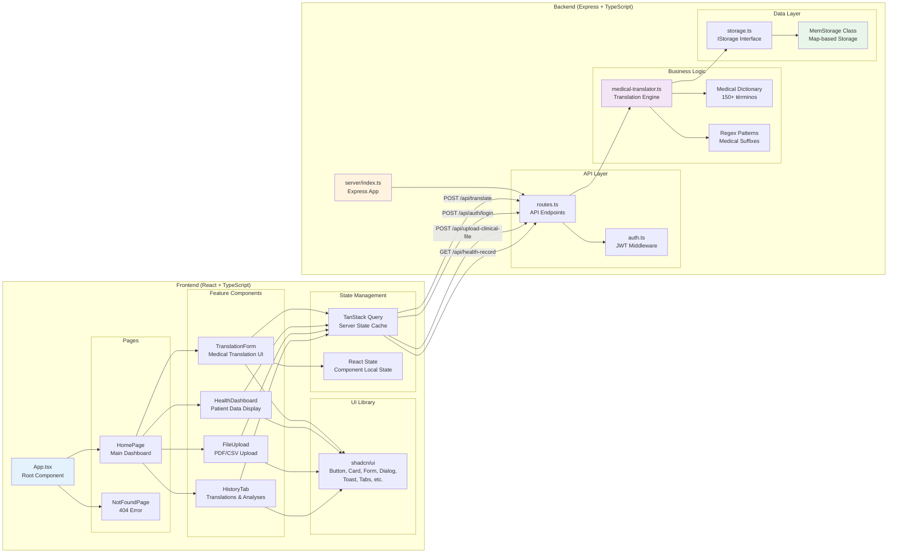
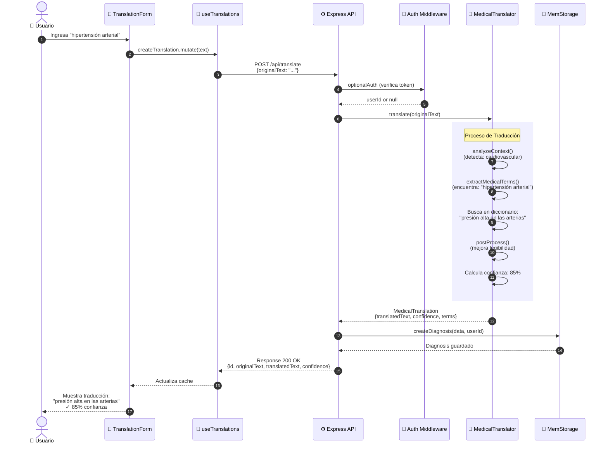
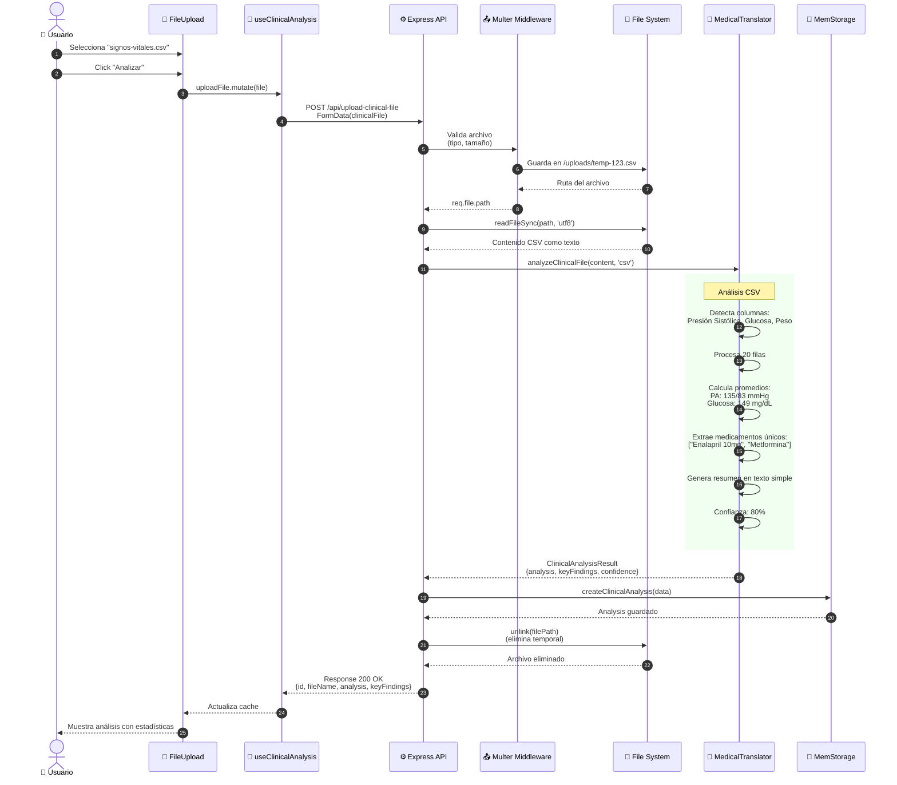
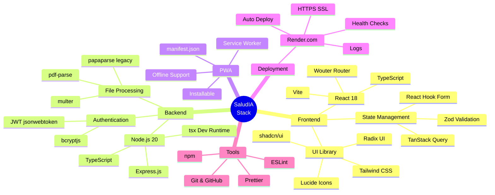
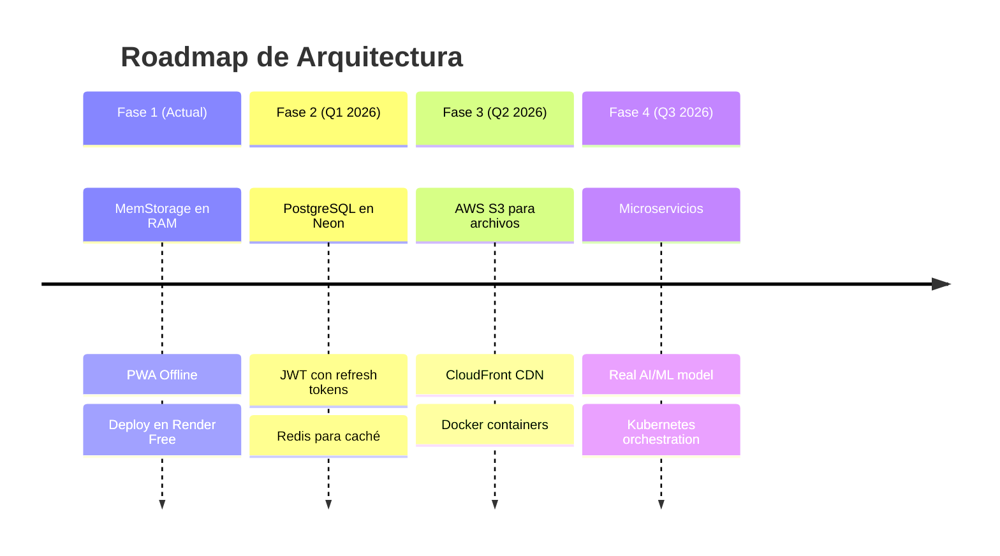
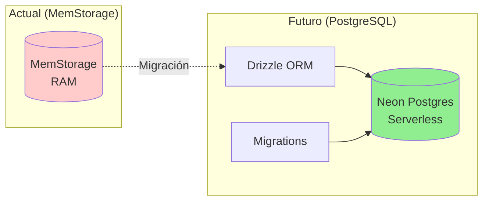
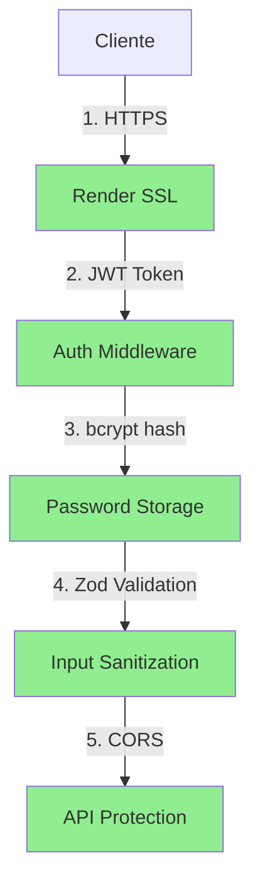

# 🏛️ Arquitectura del Sistema - SaludIA (MediTranslate)

## 📋 Índice

1. [Arquitectura General](#-arquitectura-general)
2. [Arquitectura de 3 Capas](#-arquitectura-de-3-capas)
3. [Arquitectura de Componentes](#-arquitectura-de-componentes)
4. [Diagrama de Despliegue](#-diagrama-de-despliegue)
5. [Flujo de Datos](#-flujo-de-datos)
6. [Stack Tecnológico](#-stack-tecnológico)
7. [Patrones de Diseño](#-patrones-de-diseño)

---

## 🏗️ Arquitectura General

```mermaid
graph TB
    subgraph "Cliente (Navegador/PWA)"
        UI[React UI Components]
        Hooks[React Query Hooks]
        Router[Wouter Router]
        LocalStorage[LocalStorage<br/>JWT Token]
    end
    
    subgraph "Servidor (Render.com)"
        API[Express REST API]
        Auth[JWT Auth Middleware]
        Translator[Medical Translator<br/>ClinicalBERT-like]
        Storage[MemStorage<br/>In-Memory DB]
        FileHandler[Multer<br/>File Upload]
    end
    
    subgraph "Almacenamiento"
        TempFiles[/uploads/<br/>Archivos Temporales]
        Memory[(MemStorage<br/>Users, Diagnoses, etc.)]
    end
    
    subgraph "Servicios Externos"
        PDFParser[pdf-parse<br/>Extracción de texto]
        CSVParser[Node.js fs<br/>Lectura de CSV]
    end
    
    UI --> Hooks
    Hooks --> Router
    Hooks -->|HTTP/HTTPS| API
    Router --> UI
    
    API --> Auth
    Auth --> API
    API --> Translator
    API --> Storage
    API --> FileHandler
    
    FileHandler --> TempFiles
    FileHandler --> PDFParser
    FileHandler --> CSVParser
    
    PDFParser --> Translator
    CSVParser --> Translator
    
    Translator --> Storage
    Storage --> Memory
    
    UI -.->|Guarda Token| LocalStorage
    LocalStorage -.->|Envía en Headers| API
    
    style UI fill:#e3f2fd
    style API fill:#fff3e0
    style Translator fill:#f3e5f5
    style Storage fill:#e8f5e9
```

---

## 📊 Arquitectura de 3 Capas



---

## 🧩 Arquitectura de Componentes



---

## 🌐 Diagrama de Despliegue

```mermaid
graph TB
    subgraph "Cliente (Dispositivo del Usuario)"
        direction TB
        
        subgraph "Navegadores"
            Chrome[Chrome/Edge<br/>Desktop]
            Mobile[Chrome/Safari<br/>Mobile]
            PWA[PWA Instalada<br/>Modo Standalone]
        end
        
        ServiceWorker[Service Worker<br/>Caché Offline]
        
        Chrome --> ServiceWorker
        Mobile --> ServiceWorker
        PWA --> ServiceWorker
    end
    
    subgraph "CDN / Static Hosting"
        StaticFiles[Archivos Estáticos<br/>HTML, CSS, JS, Icons]
        Manifest[manifest.json<br/>PWA Configuration]
    end
    
    subgraph "Render.com (Cloud Platform)"
        direction TB
        
        subgraph "Web Service"
            Node[Node.js Runtime<br/>v20.x]
            Express[Express Server<br/>Puerto 5000]
            Vite[Vite Dev Server<br/>Development Only]
        end
        
        subgraph "Almacenamiento Efímero"
            UploadsFolder[/uploads/<br/>Archivos Temporales<br/>Eliminados después del análisis]
            Memory[MemStorage<br/>Datos en RAM<br/>Se pierden al reiniciar]
        end
        
        subgraph "Build Process"
            TSC[TypeScript Compiler]
            ViteBuild[Vite Build<br/>Bundler]
        end
        
        Node --> Express
        Node --> Vite
        Express --> UploadsFolder
        Express --> Memory
        
        TSC --> Express
        ViteBuild --> StaticFiles
    end
    
    subgraph "Servicios de Terceros"
        NPM[NPM Registry<br/>Dependencias]
        Git[GitHub<br/>Repositorio marco344444/SaludIA]
    end
    
    Chrome -->|HTTPS| Express
    Mobile -->|HTTPS| Express
    PWA -->|HTTPS| Express
    
    ServiceWorker -.->|Caché| StaticFiles
    
    Express -->|Sirve| StaticFiles
    Express -->|Sirve| Manifest
    
    Git -->|Deploy Automático| Node
    NPM -->|Instala paquetes| Node
    
    style Chrome fill:#e3f2fd
    style Express fill:#fff3e0
    style Memory fill:#e8f5e9
    style Git fill:#f3e5f5
```

### 📝 Detalles del Despliegue

#### **Producción (Render.com)**
- **URL**: https://saludia.onrender.com
- **Tipo**: Web Service (Free Tier)
- **Build Command**: `npm run build`
- **Start Command**: `npm run start`
- **Environment**: Node.js 20.x
- **Auto-deploy**: Sí (desde main branch)

#### **Características**:
- ✅ HTTPS automático con certificado SSL
- ✅ Deploy automático al hacer push a GitHub
- ✅ Logs en tiempo real
- ✅ Health checks cada 5 minutos
- ⚠️ El servidor se duerme después de 15 min de inactividad (Free tier)
- ⚠️ MemStorage se reinicia con cada deploy (datos volátiles)

---

## 🔄 Flujo de Datos

### Flujo 1: Traducción de Diagnóstico



---

### Flujo 2: Análisis de Archivo CSV



---

## 🛠️ Stack Tecnológico



---

## 📦 Estructura de Directorios

```
SaludIA/
├── 📁 client/                      # Frontend React
│   ├── 📄 index.html              # HTML principal
│   ├── 📁 public/                 # Archivos estáticos
│   │   ├── 📄 manifest.json       # PWA manifest
│   │   ├── 📄 service-worker.js   # Service Worker
│   │   ├── 🖼️ icon-192.png        # Ícono PWA 192x192
│   │   └── 🖼️ icon-512.png        # Ícono PWA 512x512
│   └── 📁 src/
│       ├── 📄 App.tsx             # Componente raíz
│       ├── 📄 main.tsx            # Entry point
│       ├── 📄 index.css           # Estilos globales
│       ├── 📁 components/         # Componentes React
│       │   ├── 📄 translation-form.tsx
│       │   ├── 📄 health-dashboard.tsx
│       │   ├── 📄 file-upload.tsx
│       │   ├── 📄 history-tab.tsx
│       │   └── 📁 ui/             # shadcn/ui components
│       ├── 📁 hooks/              # Custom hooks
│       │   ├── 📄 use-translations.tsx
│       │   ├── 📄 use-health-data.tsx
│       │   ├── 📄 use-clinical-analysis.tsx
│       │   └── 📄 use-toast.ts
│       ├── 📁 lib/                # Utilidades
│       │   ├── 📄 queryClient.ts  # TanStack Query config
│       │   └── 📄 utils.ts        # Helpers (cn, etc.)
│       └── 📁 pages/              # Páginas
│           ├── 📄 home.tsx        # Dashboard principal
│           └── 📄 not-found.tsx   # 404
│
├── 📁 server/                      # Backend Express
│   ├── 📄 index.ts                # Server principal
│   ├── 📄 routes.ts               # API endpoints
│   ├── 📄 auth.ts                 # JWT middleware
│   ├── 📄 medical-translator.ts   # Motor de traducción
│   ├── 📄 storage.ts              # MemStorage
│   └── 📄 vite.ts                 # Vite dev server
│
├── 📁 shared/                      # Código compartido
│   └── 📄 schema.ts               # Schemas Drizzle + Zod
│
├── 📁 uploads/                     # Archivos temporales
│   └── (archivos CSV/PDF temporales)
│
├── 📄 package.json                # Dependencias
├── 📄 tsconfig.json               # TypeScript config
├── 📄 vite.config.ts              # Vite config
├── 📄 tailwind.config.ts          # Tailwind config
├── 📄 drizzle.config.ts           # Drizzle ORM config
├── 📄 DIAGRAMA-CLASES.md          # Diagrama de clases
├── 📄 CASOS-DE-USO.md             # Casos de uso
└── 📄 ARQUITECTURA.md             # Este documento
```

---

## 🎯 Patrones de Diseño Utilizados

### 1. **Repository Pattern**
```typescript
// Interfaz que define el contrato
interface IStorage {
  createUser(data: InsertUser): Promise<User>;
  getUser(id: string): Promise<User | undefined>;
  // ... más métodos
}

// Implementación en memoria
class MemStorage implements IStorage {
  private users = new Map<string, User>();
  // ... implementación
}
```
**Beneficio**: Abstracción de la capa de datos. Fácil cambiar a PostgreSQL sin tocar la lógica.

---

### 2. **Middleware Pattern**
```typescript
// Middleware de autenticación
export const authenticateToken = (
  req: AuthRequest, 
  res: Response, 
  next: NextFunction
) => {
  const token = req.headers.authorization?.split(' ')[1];
  if (!token) return res.status(401).json({...});
  
  jwt.verify(token, SECRET, (err, user) => {
    if (err) return res.status(403).json({...});
    req.userId = user.id;
    next(); // ✅ Continúa al siguiente handler
  });
};
```
**Beneficio**: Separación de concerns. Reutilizable en múltiples rutas.

---

### 3. **Strategy Pattern**
```typescript
// Diferentes estrategias de análisis según el tipo
class MedicalTranslator {
  analyzeClinicalFile(content: string, fileType: 'pdf' | 'csv') {
    if (fileType === 'csv') {
      return this.analyzeCSV(content);  // Estrategia CSV
    } else {
      return this.analyzePDF(content);  // Estrategia PDF
    }
  }
}
```
**Beneficio**: Fácil agregar nuevos tipos de archivo (Excel, DICOM, etc.)

---

### 4. **Singleton Pattern**
```typescript
// Instancia única del traductor
export const medicalTranslator = new MedicalTranslator();

// Instancia única del storage
export const storage = new MemStorage();
```
**Beneficio**: Una sola instancia compartida en toda la app.

---

### 5. **Hook Pattern (React)**
```typescript
// Custom hook que encapsula lógica de estado
export function useTranslations() {
  const queryClient = useQueryClient();
  
  const translationHistory = useQuery<Diagnosis[]>({
    queryKey: ["/api/diagnoses"],
  });
  
  const createTranslation = useMutation({
    mutationFn: async (data: { originalText: string }) => {
      const response = await apiRequest("POST", "/api/translate", data);
      return response.json();
    },
    onSuccess: () => {
      queryClient.invalidateQueries({ queryKey: ["/api/diagnoses"] });
    },
  });
  
  return { translationHistory, createTranslation };
}
```
**Beneficio**: Reutilización de lógica entre componentes. Testing más fácil.

---

### 6. **Factory Pattern (Implícito)**
```typescript
// Zod schemas actúan como factories de validación
export const insertUserSchema = createInsertSchema(users, {
  email: z.string().email("Email inválido"),
  password: z.string().min(8, "Mínimo 8 caracteres"),
}).omit({ id: true, createdAt: true });

// Uso
const validatedData = insertUserSchema.parse(req.body);
```
**Beneficio**: Validación centralizada y reutilizable.

---

## 📊 Escalabilidad y Mejoras Futuras

### Limitaciones Actuales:

| Aspecto | Limitación | Impacto |
|---------|-----------|---------|
| **Storage** | MemStorage (RAM) | ❌ Datos se pierden al reiniciar |
| **Concurrencia** | Render Free Tier | ⚠️ 1 instancia, ~512MB RAM |
| **Archivos** | Almacenamiento efímero | ❌ No se guardan permanentemente |
| **Traducción** | Diccionario estático | ⚠️ 150 términos, sin aprendizaje |

---

### Roadmap de Mejoras:



---

### Migración a PostgreSQL (Propuesta):



**Código ya preparado**:
- ✅ `drizzle.config.ts` configurado
- ✅ Schemas con `drizzle-orm/pg-core`
- ✅ Solo falta cambiar implementación de `IStorage`

---

## 🔒 Seguridad

### Capas de Seguridad Implementadas:



1. **HTTPS Obligatorio**: Render proporciona SSL automático
2. **JWT Authentication**: Tokens con expiración de 24h
3. **Password Hashing**: bcrypt con salt rounds = 10
4. **Input Validation**: Zod schemas en todas las rutas
5. **CORS Configurado**: Solo origins permitidos
6. **XSS Protection**: React escapa HTML automáticamente
7. **File Upload Limits**: 10MB máximo, solo PDF/CSV

---

## 📈 Métricas de Performance

### Tiempos de Respuesta (Promedio):

| Endpoint | Tiempo | Caché | Optimización |
|----------|--------|-------|--------------|
| `POST /api/translate` | 150ms | ❌ | Diccionario en memoria |
| `POST /api/upload-clinical-file` | 2-4s | ❌ | Depende del tamaño |
| `GET /api/health-record` | 50ms | ✅ TanStack Query | MemStorage rápido |
| `POST /api/auth/login` | 200ms | ❌ | bcrypt compare |
| Assets estáticos | 10ms | ✅ Service Worker | Vite bundling |

---

## 🎨 Decisiones de Arquitectura (ADRs)

### ADR-001: ¿Por qué MemStorage en lugar de PostgreSQL?

**Contexto**: MVP necesita deployment rápido sin complejidad de DB.

**Decisión**: Usar MemStorage (Map en RAM) temporalmente.

**Consecuencias**:
- ✅ **Pros**: Deploy instantáneo, sin costos adicionales, rápido en desarrollo
- ❌ **Cons**: Datos volátiles, no escala, se pierde al reiniciar

**Status**: Temporal → Migrar a PostgreSQL en Fase 2

---

### ADR-002: ¿Por qué TanStack Query en lugar de Redux?

**Contexto**: Necesidad de gestionar estado del servidor (API calls).

**Decisión**: Usar TanStack Query (React Query) para server state.

**Consecuencias**:
- ✅ **Pros**: Caché automático, refetch inteligente, menos boilerplate
- ✅ **Pros**: Optimistic updates, retry logic, invalidación declarativa
- ❌ **Cons**: No sirve para estado cliente (se complementa con useState)

**Status**: Permanente

---

### ADR-003: ¿Por qué diccionario estático en lugar de ML/AI real?

**Contexto**: Traducción médica requiere precisión pero MVP tiene restricciones.

**Decisión**: Diccionario + patrones regex en lugar de modelo ML.

**Consecuencias**:
- ✅ **Pros**: Sin dependencia de APIs externas, funciona offline, predecible
- ✅ **Pros**: Latencia <200ms, sin costos adicionales
- ❌ **Cons**: Limitado a 150 términos, no aprende, falsos negativos

**Status**: Temporal → Integrar OpenAI/Gemini en Fase 3

---

## 📚 Referencias

- [Express.js Best Practices](https://expressjs.com/en/advanced/best-practice-security.html)
- [React Architecture Patterns](https://react.dev/learn/thinking-in-react)
- [TanStack Query Docs](https://tanstack.com/query/latest)
- [Drizzle ORM](https://orm.drizzle.team/)
- [PWA Best Practices](https://web.dev/explore/progressive-web-apps)

---

**Generado automáticamente para el proyecto SaludIA (MediTranslate)**  
*Última actualización: 21 de octubre de 2025*  
*Versión: 1.0.0*
