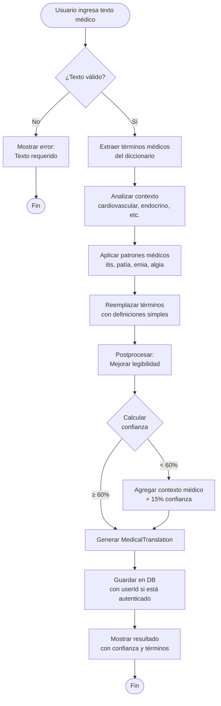
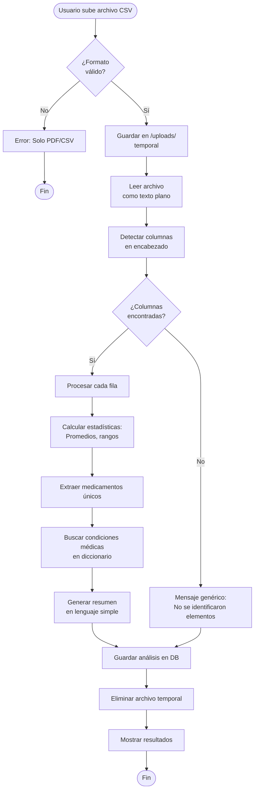

# 📋 Casos de Uso - SaludIA (MediTranslate)

## 👥 Actores del Sistema

| Actor | Descripción | Nivel de Acceso |
|-------|-------------|-----------------|
| **Paciente** | Usuario final que necesita traducir diagnósticos médicos y gestionar su historial clínico | Registrado/Anónimo |
| **Doctor** | Profesional médico que usa la app para traducir términos y analizar historiales | Registrado |
| **Usuario Anónimo** | Visitante que usa funciones básicas sin registrarse | Limitado |
| **Sistema** | Backend que procesa traducciones y análisis automáticamente | Interno |

---

## 🎯 Diagrama de Casos de Uso

```mermaid
graph TB
    %% Actores
    Paciente((Paciente))
    Doctor((Doctor))
    Anonimo((Usuario<br/>Anónimo))
    Sistema[Sistema<br/>MedicalTranslator]
    
    %% Casos de uso de autenticación
    CU01[CU-01: Registrarse]
    CU02[CU-02: Iniciar Sesión]
    CU03[CU-03: Cerrar Sesión]
    
    %% Casos de uso de traducción
    CU04[CU-04: Traducir<br/>Diagnóstico Médico]
    CU05[CU-05: Ver Historial<br/>de Traducciones]
    CU06[CU-06: Copiar/Compartir<br/>Traducción]
    
    %% Casos de uso de historial clínico
    CU07[CU-07: Ver Dashboard<br/>de Salud]
    CU08[CU-08: Actualizar Datos<br/>Personales]
    CU09[CU-09: Registrar<br/>Signos Vitales]
    CU10[CU-10: Gestionar<br/>Medicamentos]
    
    %% Casos de uso de análisis de archivos
    CU11[CU-11: Subir Archivo<br/>Médico PDF/CSV]
    CU12[CU-12: Ver Análisis<br/>de Archivo]
    CU13[CU-13: Ver Historial<br/>de Análisis]
    
    %% Relaciones de actores con casos de uso
    Anonimo --> CU01
    Anonimo --> CU02
    Anonimo --> CU04
    
    Paciente --> CU02
    Paciente --> CU03
    Paciente --> CU04
    Paciente --> CU05
    Paciente --> CU06
    Paciente --> CU07
    Paciente --> CU08
    Paciente --> CU09
    Paciente --> CU10
    Paciente --> CU11
    Paciente --> CU12
    Paciente --> CU13
    
    Doctor --> CU02
    Doctor --> CU03
    Doctor --> CU04
    Doctor --> CU05
    Doctor --> CU11
    Doctor --> CU12
    Doctor --> CU13
    
    %% Relaciones include/extend
    CU04 -.include.-> Sistema
    CU11 -.include.-> Sistema
    CU05 -.extend.-> CU06
    CU12 -.extend.-> CU06
    
    style CU04 fill:#e1f5ff
    style CU11 fill:#e1f5ff
    style Sistema fill:#fff3e0
```



---

## 📝 Especificación de Casos de Uso

### 🔐 CU-01: Registrarse en el Sistema

**Actor Principal:** Usuario Anónimo  
**Precondiciones:** Ninguna  
**Postcondiciones:** Usuario creado en el sistema con token JWT

#### Flujo Principal:
1. Usuario accede a la pantalla de registro
2. Sistema muestra formulario con campos:
   - Nombre completo
   - Email
   - Contraseña (mínimo 8 caracteres)
   - Confirmación de contraseña
   - Rol (Paciente/Doctor)
3. Usuario completa el formulario
4. Sistema valida los datos:
   - Email válido y único
   - Contraseñas coinciden
   - Nombre tiene al menos 2 caracteres
5. Sistema hashea la contraseña con bcrypt
6. Sistema crea el usuario en la base de datos
7. Sistema genera token JWT
8. Sistema devuelve usuario y token
9. Usuario es redirigido al dashboard

#### Flujos Alternativos:
- **4a. Email ya registrado:**
  - Sistema muestra error "El email ya está registrado"
  - Regresa al paso 2
  
- **4b. Contraseñas no coinciden:**
  - Sistema muestra error "Las contraseñas no coinciden"
  - Regresa al paso 2

- **4c. Contraseña débil:**
  - Sistema muestra error "La contraseña debe tener al menos 8 caracteres"
  - Regresa al paso 2

#### Reglas de Negocio:
- RN-01: El email debe ser único en el sistema
- RN-02: La contraseña debe tener mínimo 8 caracteres
- RN-03: El token JWT tiene validez de 24 horas

---

### 🔑 CU-02: Iniciar Sesión

**Actor Principal:** Usuario Registrado (Paciente/Doctor)  
**Precondiciones:** Usuario debe estar registrado  
**Postcondiciones:** Usuario autenticado con sesión activa

#### Flujo Principal:
1. Usuario accede a la pantalla de login
2. Sistema muestra formulario con campos:
   - Email
   - Contraseña
3. Usuario ingresa credenciales
4. Sistema valida formato de email
5. Sistema busca usuario por email
6. Sistema verifica contraseña con bcrypt
7. Sistema actualiza campo `lastLogin`
8. Sistema genera token JWT
9. Sistema devuelve usuario (sin contraseña) y token
10. Token se guarda en localStorage
11. Usuario es redirigido al dashboard

#### Flujos Alternativos:
- **5a. Email no encontrado:**
  - Sistema muestra error "Email o contraseña incorrectos"
  - Regresa al paso 2

- **6a. Contraseña incorrecta:**
  - Sistema muestra error "Email o contraseña incorrectos"
  - Regresa al paso 2

#### Reglas de Negocio:
- RN-04: No se debe indicar si el error es email o contraseña (seguridad)
- RN-05: El sistema registra la fecha de último login

---

### 🩺 CU-04: Traducir Diagnóstico Médico

**Actor Principal:** Usuario (Anónimo/Paciente/Doctor)  
**Actor Secundario:** Sistema MedicalTranslator  
**Precondiciones:** Ninguna  
**Postcondiciones:** Diagnóstico traducido y guardado en historial

#### Flujo Principal:
1. Usuario accede a la sección "Traducir Diagnóstico"
2. Sistema muestra formulario con campo de texto
3. Usuario ingresa texto médico (máx. 500 caracteres)
4. Usuario hace clic en "Traducir"
5. Sistema valida que el texto no esté vacío
6. Sistema envía texto a `MedicalTranslator.translate()`
7. **Sistema analiza el contexto médico** (cardiovascular, endocrino, etc.)
8. **Sistema extrae términos médicos** del diccionario
9. **Sistema aplica patrones médicos** (itis, patía, emia, etc.)
10. **Sistema calcula confianza** basado en términos identificados
11. Sistema postprocesa el texto (mejora legibilidad)
12. Sistema genera objeto `MedicalTranslation` con:
    - Texto traducido
    - Nivel de confianza (40-95%)
    - Términos identificados
13. Sistema guarda traducción en base de datos (con userId si está autenticado)
14. Sistema muestra resultado con:
    - Texto original
    - Texto traducido en lenguaje simple
    - Barra de confianza
    - Botones: Copiar, Compartir, Guardar

#### Flujos Alternativos:
- **5a. Texto vacío:**
  - Sistema muestra error "El diagnóstico es requerido"
  - Regresa al paso 3

- **5b. Texto excede 500 caracteres:**
  - Sistema muestra error "Máximo 500 caracteres"
  - Regresa al paso 3

- **10a. Confianza baja (<60%):**
  - Sistema agrega contexto médico al final
  - Aumenta confianza en 15%

#### Reglas de Negocio:
- RN-06: La traducción funciona sin autenticación
- RN-07: El diccionario médico contiene 150+ términos
- RN-08: El nivel de confianza mínimo es 40%
- RN-09: Traducciones anónimas se guardan sin userId

#### Ejemplo de Traducción:
```
Entrada: "Paciente con hipertensión arterial sistólica y diabetes mellitus tipo 2"

Salida: "Paciente que presenta presión alta cuando el corazón late y azúcar alta en la sangre donde el cuerpo no usa bien la insulina"

Confianza: 85%
Términos identificados: ["hipertensión arterial sistólica", "diabetes mellitus tipo 2"]
```

---

### 📁 CU-11: Subir Archivo Médico (PDF/CSV)

**Actor Principal:** Usuario Registrado (Paciente/Doctor)  
**Actor Secundario:** Sistema MedicalTranslator  
**Precondiciones:** Usuario debe estar autenticado  
**Postcondiciones:** Archivo analizado y resultados guardados

#### Flujo Principal:
1. Usuario accede a la sección "Análisis de Archivos"
2. Sistema muestra zona de carga de archivos con instrucciones:
   - Formatos soportados: PDF, CSV
   - Tamaño máximo: 10MB
3. Usuario selecciona archivo desde su dispositivo
4. Sistema valida el archivo:
   - Formato permitido (PDF/CSV)
   - Tamaño menor a 10MB
5. Usuario hace clic en "Analizar"
6. Sistema sube archivo a carpeta temporal `/uploads`
7. Sistema detecta tipo de archivo por extensión

#### Para archivos PDF:
8a. Sistema usa `pdf-parse` para extraer texto
9a. Sistema detecta secciones: "Signos Vitales", "Diagnóstico", "Medicamentos"
10a. Sistema extrae datos dentro de cada sección

#### Para archivos CSV:
8b. Sistema lee archivo como texto plano
9b. Sistema detecta columnas en el encabezado:
   - Presión Sistólica/Diastólica
   - Glucosa (mg/dL)
   - Peso (kg)
   - Medicamento Tomado
10b. Sistema procesa cada fila de datos
11b. Sistema calcula estadísticas:
   - Promedios (presión, glucosa, peso)
   - Rangos (mínimo-máximo)
   - Número de registros

#### Común para ambos:
11. Sistema envía contenido a `MedicalTranslator.analyzeClinicalFile()`
12. **Sistema identifica:**
    - Condiciones médicas (usando diccionario)
    - Medicamentos (patrón: nombre + dosis + unidad)
    - Signos vitales (presión, saturación O2, etc.)
    - Recomendaciones (frases con "recomienda", "debe", etc.)
13. Sistema genera resumen en lenguaje simple
14. Sistema calcula confianza (40-80%)
15. Sistema guarda análisis en base de datos con:
    - Nombre del archivo
    - Tipo (pdf/csv)
    - Contenido original (primeros 10,000 caracteres)
    - Análisis generado
    - Hallazgos clave (conditions, medications, vitals, recommendations)
    - Nivel de confianza
16. Sistema elimina archivo temporal
17. Sistema muestra resultados con:
    - Resumen del análisis
    - Secciones: Condiciones, Medicamentos, Signos Vitales, Recomendaciones
    - Botón para copiar/compartir

#### Flujos Alternativos:
- **4a. Formato no soportado:**
  - Sistema muestra error "Solo se permiten archivos PDF y CSV"
  - Regresa al paso 3

- **4b. Archivo muy grande:**
  - Sistema muestra error "El archivo excede el límite de 10MB"
  - Regresa al paso 3

- **8a. Error al procesar PDF:**
  - Sistema muestra error "Error al procesar el PDF. Verifica que no esté dañado o protegido."
  - Elimina archivo temporal
  - Termina caso de uso

- **12a. No se identifican elementos:**
  - Sistema genera mensaje: "Se ha analizado el historial clínico pero no se han podido identificar elementos específicos."
  - Confianza = 40%
  - Continúa al paso 15

#### Reglas de Negocio:
- RN-10: Solo usuarios autenticados pueden subir archivos
- RN-11: Los archivos temporales se eliminan después del análisis
- RN-12: El análisis CSV prioriza estadísticas agregadas sobre registros individuales
- RN-13: Para CSV, se buscan columnas específicas por nombre (case-insensitive)

#### Ejemplo de Análisis CSV:
```
Entrada: ejemplo-signos-vitales.csv (20 registros)

Salida:
"Resumen del historial clínico:

Los signos vitales registrados incluyen: 
- Presión arterial (20 registros): Promedio 135/83 mmHg, Rango 128-148/76-92 mmHg
- Glucosa (20 registros): Promedio 149 mg/dL, Rango 132-170 mg/dL
- Peso (20 registros): Promedio 93.8 kg, Rango 93.0-95.2 kg

Está tomando los siguientes medicamentos: Enalapril 10mg, Metformina 850mg, Atorvastatina 20mg, Aspirina 100mg."

Confianza: 80%
```

---

### 📊 CU-07: Ver Dashboard de Salud

**Actor Principal:** Usuario Registrado (Paciente)  
**Precondiciones:** Usuario debe estar autenticado  
**Postcondiciones:** Ninguna

#### Flujo Principal:
1. Usuario inicia sesión en el sistema
2. Sistema obtiene `userId` del token JWT
3. Sistema busca `HealthRecord` asociado al usuario
4. Si no existe, Sistema crea registro con:
   - patientName = fullName del usuario
   - age = null
   - conditions = []
   - medications = []
5. Sistema muestra dashboard con secciones:
   - **Datos Personales:** Nombre, Edad
   - **Condiciones Médicas:** Lista editable de enfermedades
   - **Signos Vitales:** Presión arterial, glucosa, peso (último registro)
   - **Medicamentos:** Lista con nombre, dosis, horario, estado (tomado/pendiente)
   - **Indicadores PWA:** Estado de instalación, conexión online/offline
6. Usuario puede editar edad y condiciones haciendo clic en el ícono de edición
7. Sistema abre diálogo de edición
8. Usuario modifica campos
9. Usuario hace clic en "Guardar"
10. Sistema valida datos
11. Sistema actualiza `HealthRecord` en base de datos
12. Sistema muestra mensaje de éxito
13. Dashboard se actualiza automáticamente

#### Flujos Alternativos:
- **3a. Usuario no tiene HealthRecord:**
  - Sistema crea uno nuevo automáticamente
  - Continúa al paso 5

- **10a. Edad inválida:**
  - Sistema muestra error "La edad debe ser un número entre 0 y 120"
  - Regresa al paso 8

#### Reglas de Negocio:
- RN-14: Cada usuario registrado tiene un único HealthRecord
- RN-15: Los datos del dashboard son privados (solo el usuario puede verlos)
- RN-16: La edad es opcional

---

### 🔍 CU-05: Ver Historial de Traducciones

**Actor Principal:** Usuario Registrado  
**Precondiciones:** Usuario debe estar autenticado  
**Postcondiciones:** Ninguna

#### Flujo Principal:
1. Usuario accede a la pestaña "Historial"
2. Sistema obtiene `userId` del token
3. Sistema consulta todas las traducciones del usuario (ordenadas por fecha desc)
4. Sistema muestra lista con:
   - Fecha y hora de traducción
   - Texto original (truncado a 100 caracteres)
   - Texto traducido (truncado a 100 caracteres)
   - Nivel de confianza
   - Botón "Ver completo"
5. Usuario hace clic en "Ver completo"
6. Sistema muestra diálogo modal con:
   - Texto original completo
   - Texto traducido completo
   - Términos identificados
   - Nivel de confianza
   - Botones: Copiar, Compartir, Cerrar

#### Flujos Alternativos:
- **3a. Usuario no tiene traducciones:**
  - Sistema muestra mensaje "No tienes traducciones guardadas aún"
  - Botón "Traducir ahora" que redirige a CU-04

#### Reglas de Negocio:
- RN-17: Solo se muestran traducciones del usuario autenticado
- RN-18: Las traducciones anónimas no aparecen en el historial

---

### 🔄 CU-06: Copiar/Compartir Traducción

**Actor Principal:** Usuario  
**Precondiciones:** Debe haber una traducción activa  
**Postcondiciones:** Traducción copiada al portapapeles o compartida

#### Flujo Principal - Copiar:
1. Usuario visualiza una traducción
2. Usuario hace clic en botón "Copiar"
3. Sistema copia texto traducido al portapapeles usando `navigator.clipboard`
4. Sistema muestra notificación toast "Copiado al portapapeles"

#### Flujo Principal - Compartir:
1. Usuario visualiza una traducción
2. Usuario hace clic en botón "Compartir"
3. Sistema verifica si `navigator.share` está disponible
4. Sistema abre diálogo nativo de compartir con:
   - title: "Traducción médica - SaludIA"
   - text: Texto traducido
5. Usuario selecciona app para compartir (WhatsApp, Email, etc.)
6. Sistema muestra notificación toast "Compartido exitosamente"

#### Flujos Alternativos:
- **3a. Navegador no soporta clipboard API:**
  - Sistema usa fallback: selecciona texto y ejecuta `document.execCommand('copy')`
  - Continúa al paso 4

- **3b. API Share no disponible:**
  - Sistema muestra error "Función de compartir no disponible en este navegador"
  - Sugiere usar botón "Copiar"

#### Reglas de Negocio:
- RN-19: La función de compartir solo funciona en HTTPS o localhost
- RN-20: En dispositivos móviles se usa el diálogo nativo del sistema

---

### 💊 CU-10: Gestionar Medicamentos

**Actor Principal:** Paciente  
**Precondiciones:** Usuario debe estar autenticado y tener HealthRecord  
**Postcondiciones:** Lista de medicamentos actualizada

#### Flujo Principal - Agregar:
1. Usuario accede al dashboard de salud
2. Usuario hace clic en "Agregar Medicamento"
3. Sistema muestra formulario con campos:
   - Nombre del medicamento
   - Dosis (ej: 10mg, 850mg)
   - Instrucciones (ej: "Con el desayuno")
   - Hora de toma (HH:MM)
4. Usuario completa el formulario
5. Usuario hace clic en "Guardar"
6. Sistema valida que el nombre no esté vacío
7. Sistema agrega medicamento al array `medications` del HealthRecord
8. Sistema actualiza base de datos
9. Sistema muestra notificación "Medicamento agregado"
10. Dashboard se actualiza mostrando el nuevo medicamento

#### Flujo Principal - Marcar como Tomado:
1. Usuario ve lista de medicamentos con checkbox
2. Usuario marca checkbox "Tomado"
3. Sistema actualiza campo `taken: true` del medicamento
4. Sistema guarda cambio en base de datos
5. Sistema muestra medicamento con estilo diferente (tachado o con ✓)

#### Flujo Principal - Eliminar:
1. Usuario hace clic en ícono de papelera junto al medicamento
2. Sistema muestra confirmación "¿Seguro que deseas eliminar este medicamento?"
3. Usuario confirma
4. Sistema elimina medicamento del array
5. Sistema actualiza base de datos
6. Dashboard se actualiza

#### Flujos Alternativos:
- **6a. Nombre vacío:**
  - Sistema muestra error "El nombre del medicamento es requerido"
  - Regresa al paso 4

#### Reglas de Negocio:
- RN-21: Un medicamento debe tener al menos nombre y dosis
- RN-22: Los medicamentos se resetean diariamente (taken = false)
- RN-23: Se pueden tener múltiples medicamentos con el mismo nombre pero diferentes dosis

---

## 📈 Matriz de Trazabilidad

| Caso de Uso | Requisito Funcional | Prioridad | Actor Principal | Componente Backend | Componente Frontend |
|-------------|---------------------|-----------|-----------------|-------------------|---------------------|
| CU-01 | RF-01: Registro de usuarios | Alta | Anónimo | AuthService, Storage | RegisterForm |
| CU-02 | RF-02: Autenticación JWT | Alta | Usuario | AuthService, Storage | LoginForm |
| CU-03 | RF-03: Cerrar sesión | Media | Usuario | - | useAuth hook |
| CU-04 | RF-04: Traducción médica | Alta | Todos | MedicalTranslator | TranslationForm |
| CU-05 | RF-05: Historial de traducciones | Media | Usuario | Storage | HistoryTab |
| CU-06 | RF-06: Copiar/Compartir | Baja | Todos | - | Share API |
| CU-07 | RF-07: Dashboard de salud | Alta | Paciente | Storage | HealthDashboard |
| CU-08 | RF-08: Actualizar datos | Media | Paciente | Storage | HealthDashboard |
| CU-09 | RF-09: Signos vitales | Media | Paciente | Storage | HealthDashboard |
| CU-10 | RF-10: Gestión medicamentos | Alta | Paciente | Storage | HealthDashboard |
| CU-11 | RF-11: Subir archivos | Alta | Usuario | MedicalTranslator, Multer | FileUpload |
| CU-12 | RF-12: Ver análisis | Alta | Usuario | Storage | HistoryTab |
| CU-13 | RF-13: Historial análisis | Media | Usuario | Storage | HistoryTab |

---

## 🎨 Diagrama de Flujo - Proceso de Traducción



---

## 📱 Diagrama de Flujo - Análisis de Archivo CSV



---

## 🔒 Requisitos No Funcionales Relacionados

| ID | Requisito | Relacionado con CU |
|----|-----------|-------------------|
| RNF-01 | Seguridad: Contraseñas hasheadas con bcrypt | CU-01, CU-02 |
| RNF-02 | Autenticación: JWT con expiración 24h | CU-02, Todos los CU autenticados |
| RNF-03 | Performance: Traducción en < 2 segundos | CU-04 |
| RNF-04 | Performance: Análisis de archivo en < 5 segundos | CU-11 |
| RNF-05 | Usabilidad: Interfaz responsive (móvil/desktop) | Todos los CU |
| RNF-06 | Disponibilidad: PWA funciona offline (traducciones básicas) | CU-04 |
| RNF-07 | Escalabilidad: Soportar 100+ usuarios concurrentes | Todos los CU |
| RNF-08 | Privacidad: Datos médicos encriptados en tránsito (HTTPS) | Todos los CU |

---

## 📊 Métricas de Éxito

| Caso de Uso | Métrica | Objetivo |
|-------------|---------|----------|
| CU-04 | Tasa de éxito de traducción | > 95% |
| CU-04 | Confianza promedio | > 75% |
| CU-11 | Tasa de éxito de análisis de archivos | > 90% |
| CU-02 | Tiempo promedio de login | < 1 segundo |
| CU-01 | Tasa de conversión registro → usuario activo | > 60% |
| CU-07 | Usuarios que actualizan su dashboard | > 40% |

---

**Generado automáticamente para el proyecto SaludIA (MediTranslate)**  
*Última actualización: 21 de octubre de 2025*
