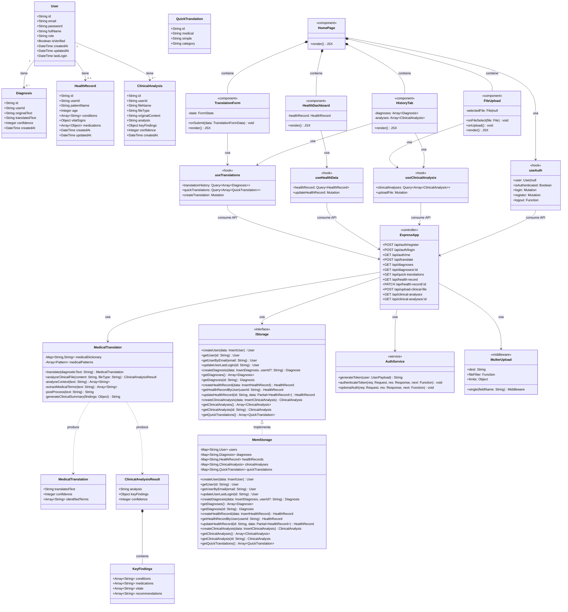
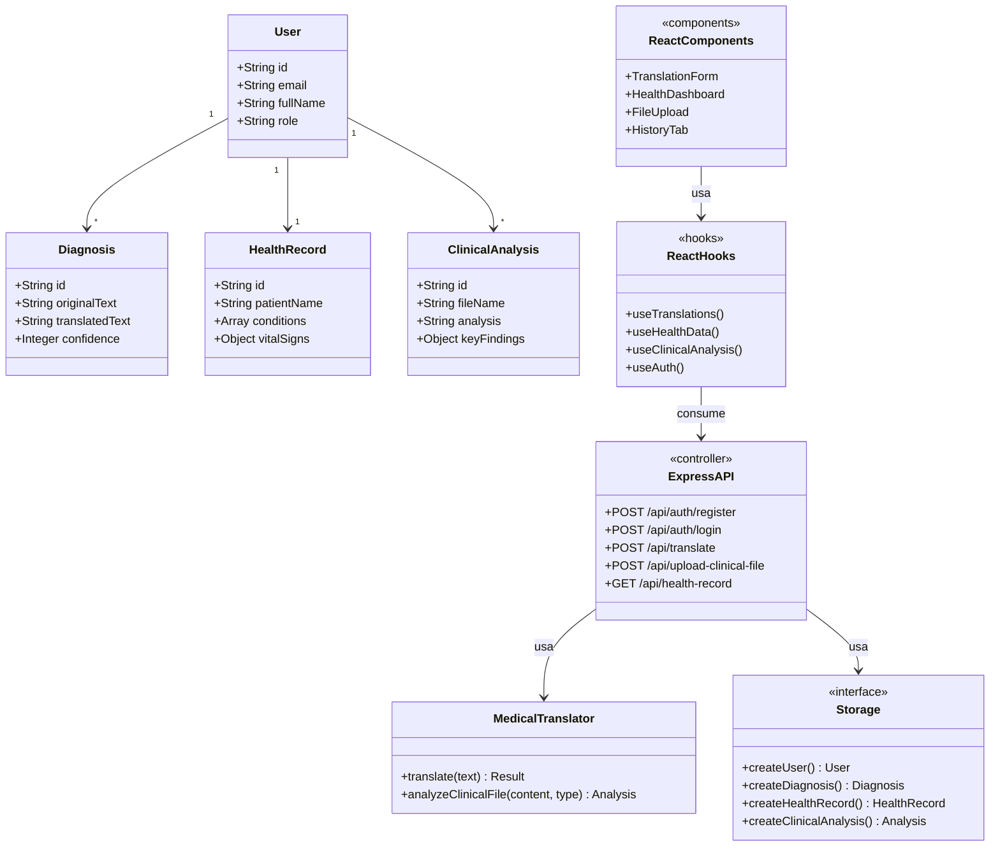
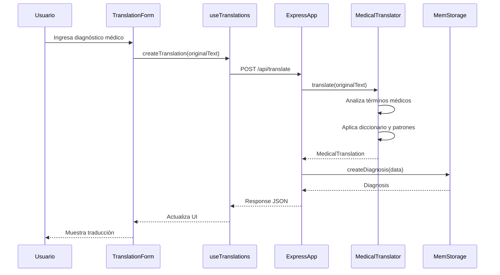
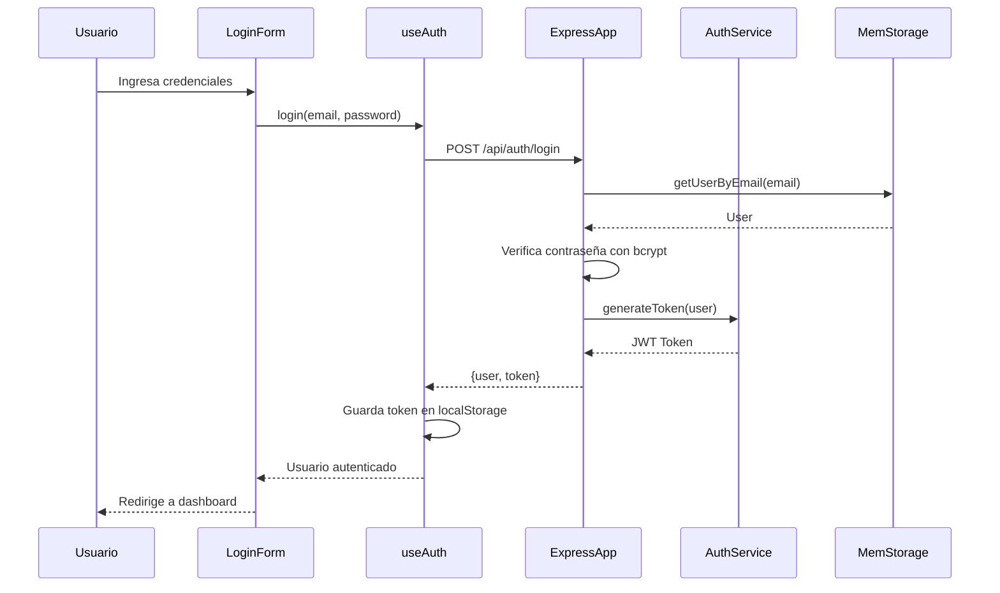
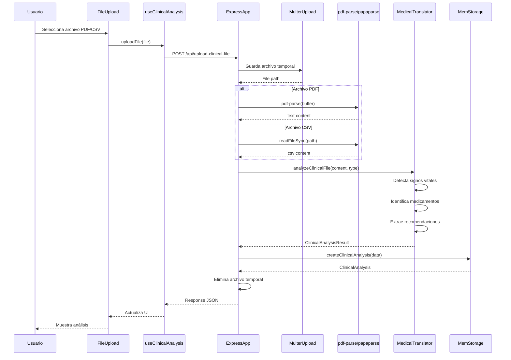

# 🏗️ Diagrama de Clases - SaludIA (MediTranslate)

## Visualización del Diagrama

Este diagrama se renderiza automáticamente en:
- ✅ GitHub
- ✅ VS Code (con extensión Markdown Preview Mermaid Support)
- ✅ GitLab
- ✅ Notion
- ✅ [Mermaid Live Editor](https://mermaid.live/)

---

## 📊 Diagrama de Clases Completo



---

## 📊 Diagrama Simplificado (Para Presentaciones)



---

## 📝 Descripción de Capas

### 🗄️ Capa de Datos (Database Schema)
- **User**: Información de usuarios (pacientes, doctores)
- **Diagnosis**: Traducciones de diagnósticos médicos
- **HealthRecord**: Historial clínico del paciente
- **ClinicalAnalysis**: Análisis de archivos PDF/CSV
- **QuickTranslation**: Diccionario de traducciones rápidas

### ⚙️ Capa de Lógica de Negocio (Backend Services)
- **MedicalTranslator**: Algoritmo principal de traducción médica (basado en ClinicalBERT)
- **IStorage / MemStorage**: Interfaz y implementación de persistencia de datos
- **AuthService**: Autenticación y autorización con JWT

### 🌐 Capa de API (Express Routes)
- **ExpressApp**: Controlador principal con todos los endpoints REST
- **MulterUpload**: Middleware para manejo de archivos

### 🎨 Capa de Presentación (React)
- **Hooks**: `useTranslations`, `useHealthData`, `useClinicalAnalysis`, `useAuth`
- **Componentes**: `TranslationForm`, `HealthDashboard`, `FileUpload`, `HistoryTab`, `HomePage`

---

## 🔄 Flujo de Datos Principal



---

## 🔐 Flujo de Autenticación



---

## 📤 Flujo de Análisis de Archivos



---

## 🛠️ Herramientas para Visualizar

### 1. **VS Code** (Recomendado)
Instala la extensión:
```
Markdown Preview Mermaid Support
```

### 2. **Mermaid Live Editor**
Abre [mermaid.live](https://mermaid.live/) y pega el código del diagrama.

### 3. **GitHub**
GitHub renderiza automáticamente los diagramas Mermaid en archivos `.md`.

### 4. **PlantUML** (Alternativa)
Si prefieres PlantUML, puedo generar también ese formato.

---

## 📚 Leyenda de Símbolos

| Símbolo | Significado |
|---------|-------------|
| `+` | Método o propiedad pública |
| `-` | Método o propiedad privada |
| `<<interface>>` | Interfaz |
| `<<service>>` | Servicio |
| `<<controller>>` | Controlador |
| `<<component>>` | Componente React |
| `<<hook>>` | Hook de React |
| `-->` | Asociación |
| `*--` | Composición |
| `<|..` | Implementa interfaz |
| `..>` | Dependencia |

---

## 🎯 Patrones de Diseño Identificados

1. **Repository Pattern**: `IStorage` / `MemStorage`
2. **Strategy Pattern**: `MedicalTranslator` con diferentes algoritmos de análisis
3. **Middleware Pattern**: `MulterUpload`, `authenticateToken`
4. **Hook Pattern**: Custom hooks de React Query
5. **MVC Pattern**: Separación entre modelos, vistas (React) y controladores (Express)

---

**Generado automáticamente para el proyecto SaludIA (MediTranslate)**  
*Última actualización: 21 de octubre de 2025*
